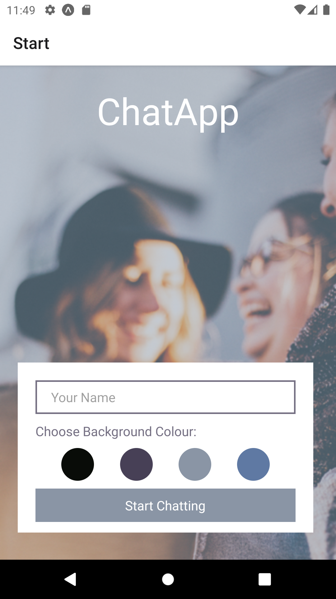

# ChatApp



ChatApp is a cross-platform mobile application built using React Native, Expo, Gifted Chat and Google Firebase that allows users to participate in a group chat. They can read and send messages, share images and share their location. The app uses Async Storage to allow users to view messages even when they are offline.

## Key features

- On launching the app users enter their name and can select a background colour. The "Start Chatting" button takes them to the chat room where their name will be displayed against the chosen background.
- If connected to the internet they will see all the existing messages in the chat, with the most recent displayed first. They can join in by composing and sending messages using an input bar at the foot of the screen.
- The input bar contains an action button that when pressed brings up additional options. Users can select and send images, take and send pictures using their phone camera or send their physical location, which will be displayed on a map inside their message. Users grant permission for the app to access their camera, images or location information via a modal that appears when they select the respective actions.
- When users are online, all of the existing messages in the conversation plus any new messages sent during their session are stored on their device using Async Storage. This means that if they subsequently try to use the app when they have no internet connection, they will still be able to see all of the messages displayed. 
- Because users cannot **send** messages when they have no internet connection, the input bar is configured to be invisible when the user status is offline.
- If a user opens the app for the very first time and they have no internet connection they will simply see a blank screen in the selected background colour with their name at the top.
- The input bar and buttons are accessible, making the app suitable for all users.
- Google's Firebase platform is used to implement user authentication. Firebase also provides the database for the chat messages and storage for saved image files.
- ChatApp is a cross-platform application and works on both Android and iOS devices.

## Technologies

- React 
- React Native
- Expo 
- Gifted Chat
- Firebase 

## Installation and set up

This project requires NPM to install the required packages. NPM is included when you install Node.js. The relevant documentation can be found [here](https://nodejs.org/en/).

To create and run Expo projects you must firstly install the expo cli: 
```
npm install expo-cli--global
```
You will also need an Expo account. Head to the [signup](https://expo.dev/) page and follow the instructions.
Next create a project directory in your chosen location by running: 
```
expo init *your-project-name*
```
Now clone the project files from Github into the local project directory (instructions can be found [here](https://docs.github.com/en/repositories/creating-and-managing-repositories/cloning-a-repository)) and install the packages used within the project by running:
```
npm install
``` 
You will need to create a project in Firebase in order to set up the database for the messages, add storage for sent images and implement user authentication: 
- Log in to Firebase using your Google credentials, go to the console and click on either Create Project or Add Project. 
- Name the project and click Create. 
- From the project dashboard select Firestore Database and follow the steps (in this simple example we start in test mode so we don't need to worry about configuring database access rules to begin with). Add a collection for messages. 
- Select Storage from the dashboard and follow the instructions to set up your storage.
- Next go to Project Settings and click on the </> icon to register the app. Follow the registration steps. You will be provided with the code to configure the app and connect it to your project. Use this code to replace the current config object (inside the initializeApp function) on lines 28-33 of Chat.js. 
- Finally, from the project dashboard select Authentication. Click on anonymous and move the slider to "Enabled".

You can now start the project by running either: 
```
npm start or expo start
```
A new tab will open showing the Metro Bundler, which is an http server that transpiles the JavaScript files using Babel then serves them to the Expo app. Options on the left hand side of the screen will allow you to run the project in the browser, on an emulator or simulator, or on your phone using the QR code that will be displayed. These options will also appear in your terminal. 

To run the project on your phone you must first download the Expo app from the relevant app store for your device before scanning the QR code provided. To run the project from an emulator, you must first configure a device using [Android Studio](https://developer.android.com/studio). An iOS simulator can alternatively be set up on a Mac using [Xcode](https://apps.apple.com/app/xcode).

## A note on Firebase

This project uses Firebase version 8.2.3. Firebase version 9 uses a modular approach whereby in order to improve performance individual functions are imported when needed instead of importing the whole library. Whilst all of the functionality in the project can be achieved using version 9, the syntax used here will need to be adapted in order for the project to run.

The Firebase console is periodically updated by Google to improve useability so the individual steps to set up and configure projects may change from time to time. The steps above are intended as a guide based on the process in place at the time the project was created (December 2021).

## Author

GitHub: [@penny167](https://github.com/Penny167)